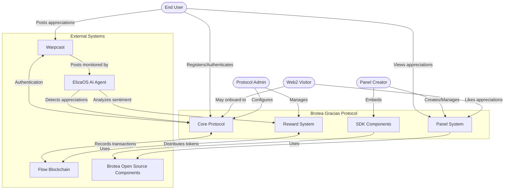

# Brotea Gracias Protocol - Project Summary

## Project Summary

The Brotea Gracias Protocol is a web3/web2 hybrid system that enables users to create, manage, and validate appreciations between various entities (individuals, projects, communities) using Warpcast social posts and Flow blockchain for verification. The protocol leverages AI for appreciation detection and sentiment analysis, implements a token-based reward system, and provides SDK components for external site integration, creating a comprehensive ecosystem for recognition that builds community and reinforces positive interactions.

## Key Objectives

- Create a decentralized appreciation system that works across web2 and web3 platforms
- Integrate with Warpcast for user authentication and social interaction
- Implement a token-based reward system for appreciations (1 USDC per appreciation)
- Enable users to create and manage public appreciation panels with custom hashtags
- Provide SDK components for displaying appreciations on external sites
- Establish a sustainable economic model through transaction fees
- Distribute weekly rewards to the most meaningful appreciations using AI sentiment analysis
- Facilitate web3 onboarding for web2 users through a simplified authentication flow

## System Context Diagram

## Risk/Constraints Matrix

| Risk/Constraint | Impact | Likelihood | Mitigation Strategy |
|-----------------|--------|------------|---------------------|
| Warpcast API limitations | High | Medium | Implement robust error handling and rate limiting compliance; develop fallback mechanisms |
| Flow blockchain transaction costs | Medium | High | Optimize batch processing and fee structure; implement efficient smart contracts |
| AI accuracy in detecting appreciations | High | Medium | Continuous training and human review of edge cases; implement confidence thresholds |
| User adoption of web3 features | Medium | High | Provide seamless web2 experience with optional web3 onboarding; focus on UX simplicity |
| Security of user wallets | Critical | Low | Leverage Warpcast's security model and add additional safeguards; regular security audits |
| Scalability of reward distribution | Medium | Medium | Implement efficient smart contracts and optimize gas usage; consider layer 2 solutions |
| Regulatory compliance for token distribution | High | Medium | Consult legal experts and implement necessary compliance measures; stay updated on regulations |
| Integration complexity with existing systems | Medium | Medium | Develop clear APIs and comprehensive documentation; provide integration support |
| Dependency on Warpcast platform | High | Low | Design for potential multi-platform support in the future; maintain good relationship with Warpcast team |
| Protocol fee sustainability | Medium | Medium | Regularly review and adjust fee structure; develop additional revenue streams if needed |

## Success Metrics

| Metric | Target | Measurement Method | Timeframe |
|--------|--------|-------------------|-----------|
| User Registration | 10,000 users | User database count | First 6 months |
| Appreciation Panels Created | 1,000 panels | Panel database count | First 3 months |
| Weekly Appreciations Processed | 5,000 per week | Transaction logs | By month 6 |
| Web2 to Web3 Conversion Rate | 15% | Onboarding funnel analytics | Ongoing |
| Protocol Fee Revenue | Cover operational costs | Financial reporting | By month 9 |
| User Retention | 70% monthly active users | Usage analytics | Ongoing |
| Sentiment Score Improvement | 25% increase in positive sentiment | AI sentiment analysis reports | First year |
| SDK Integration | 100 external sites | Integration tracking | By year 1 |
| Average Appreciation Value | 10+ likes per appreciation | Engagement metrics | By month 6 |
| Weekly Reward Distribution | $1,000+ in rewards | Distribution logs | By month 3 |

## Business Understanding

### What specific problem does this solution address?
The Brotea Gracias Protocol addresses the lack of verifiable, incentivized recognition systems that work across web2 and web3 platforms. Traditional appreciation systems (like testimonials or endorsements) lack transparency, verification, and incentives. This protocol creates a bridge between casual social media appreciations and blockchain-verified recognition with economic incentives.

### Who are the primary users/beneficiaries?
1. **Individuals** seeking recognition for their contributions
2. **Projects/Communities** wanting to highlight contributors
3. **Organizations** looking to implement recognition systems
4. **Web3 Projects** seeking to onboard web2 users through a familiar interaction model
5. **Content Creators** who want to showcase appreciations from their community

### What are the key business outcomes expected?
1. Creation of a self-sustaining protocol through transaction fees
2. Increased engagement and positive interactions within the Brotea ecosystem
3. Growth of the Brotea user base through web2 to web3 onboarding
4. Establishment of a standard for blockchain-verified appreciations
5. Development of valuable sentiment data through AI analysis

## Technical Constraints

1. **Warpcast Integration**: The system is initially dependent on Warpcast for authentication and social interaction
2. **Flow Blockchain**: Smart contracts and transactions are built on the Flow blockchain
3. **Transaction Costs**: Each appreciation requires a 1 USDC transaction
4. **ElizaOS Capabilities**: The AI agent's ability to detect and analyze appreciations depends on ElizaOS capabilities
5. **SDK Compatibility**: The SDK must work across various web platforms and frameworks
6. **Scalability**: The system must handle increasing numbers of users and transactions efficiently
7. **Security**: User wallets and funds must be protected with robust security measures

## Implementation Considerations

1. **Phased Rollout**: Implement core features first, then expand with additional functionality
2. **User Experience Focus**: Prioritize simplicity and intuitive design, especially for web2 users
3. **Developer Documentation**: Create comprehensive documentation for SDK integration
4. **Community Engagement**: Involve the community in testing and feedback loops
5. **Regulatory Compliance**: Ensure all token-related activities comply with relevant regulations
6. **Performance Optimization**: Optimize for speed and cost-efficiency in blockchain transactions
7. **Analytics Implementation**: Build robust analytics to track success metrics from the start
