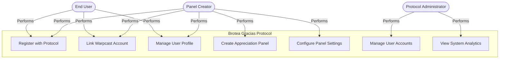
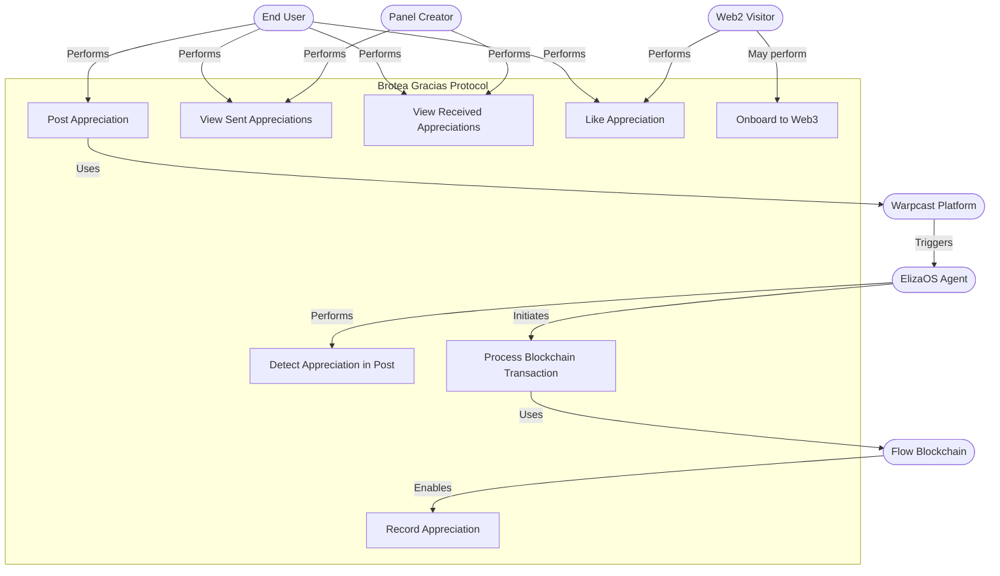
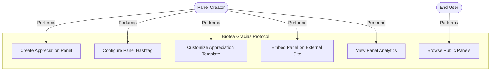
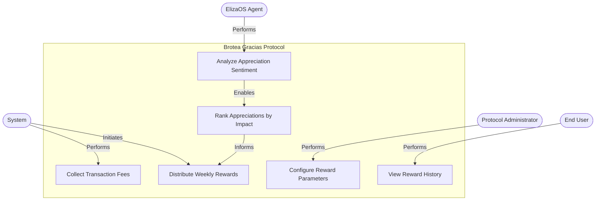

# Brotea Gracias Protocol - Use Case Diagrams

This document provides formal UML use case diagrams for the Brotea Gracias Protocol, detailing the interactions between actors and the system.

## Primary Actors

- **End User**: Person who wants to acknowledge others or receive appreciations
- **Panel Creator**: User who creates and manages appreciation panels
- **Web2 Visitor**: Non-wallet user who can validate appreciations via likes
- **Protocol Administrator**: Brotea team member managing the protocol infrastructure
- **ElizaOS Agent**: AI system for detecting and processing appreciations
- **Warpcast Platform**: External social platform integrated with the protocol
- **Flow Blockchain**: External blockchain system for recording transactions

## Use Case Diagram: User Management



## Use Case Diagram: Appreciation Operations



## Use Case Diagram: Panel Management



## Use Case Diagram: Reward System



## Use Case Diagram: SDK Integration

```mermaid
flowchart TD
    Developer([External Developer])
    PanelCreator([Panel Creator])
    
    subgraph "Brotea Gracias Protocol SDK"
        IntegrateSDK[Integrate SDK]
        DisplayAppreciations[Display Appreciations]
        RenderThankButton[Render Thank Button]
        RenderLikeButton[Render Like Button]
        CustomizeDisplay[Customize Display]
        FetchAppreciations[Fetch Appreciation Data]
    end
    
    Developer -->|Performs| IntegrateSDK
    Developer -->|Configures| DisplayAppreciations
    Developer -->|Configures| RenderThankButton
    Developer -->|Configures| RenderLikeButton
    Developer -->|Performs| CustomizeDisplay
    
    PanelCreator -->|Configures| DisplayAppreciations
    
    DisplayAppreciations -->|Uses| FetchAppreciations
    RenderThankButton -->|Uses| FetchAppreciations
    RenderLikeButton -->|Uses| FetchAppreciations
