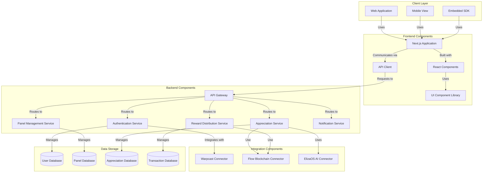
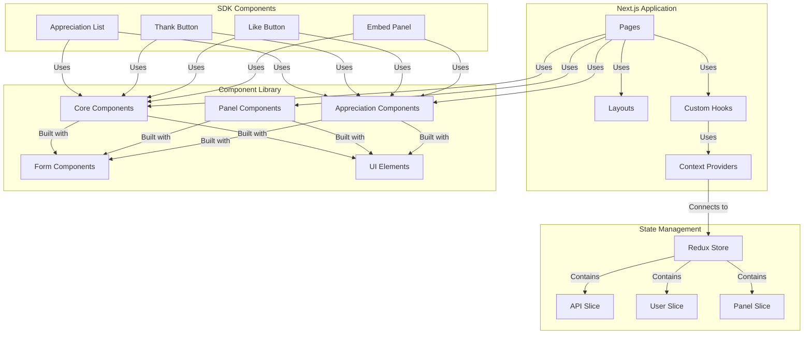
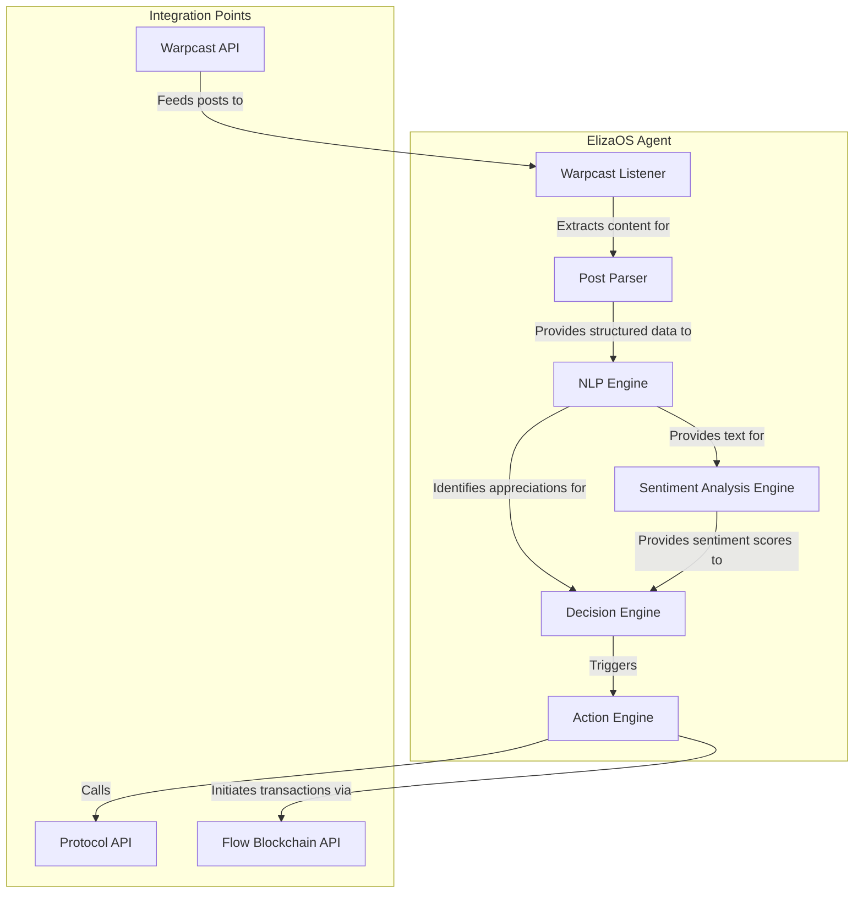
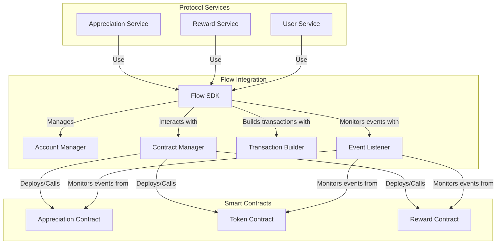
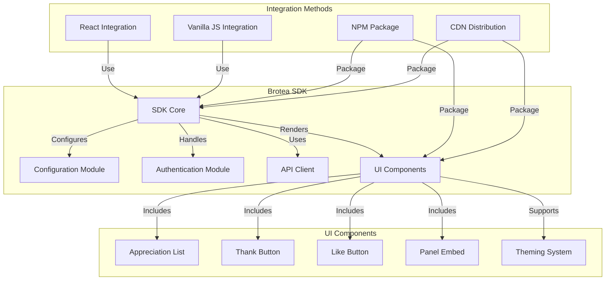
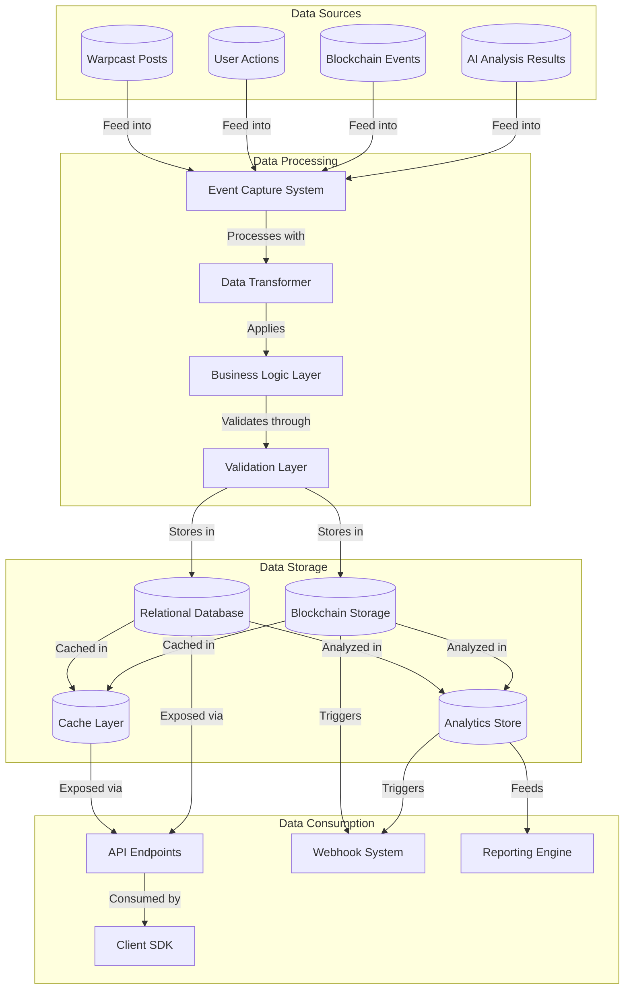

# Brotea Gracias Protocol - Component Diagrams

This document provides detailed component diagrams for the Brotea Gracias Protocol, illustrating the technical architecture and interactions between system components.

## Technology Stack Overview

- **Frontend**: Next.js
- **AI Agent**: ElizaOS
- **Blockchain**: Flow
- **Social Integration**: Warpcast
- **Open Source Components**: Brotea ecosystem components

## System Architecture Components



## Frontend Component Architecture



## Backend Service Architecture

```mermaid
flowchart TD
    subgraph "API Gateway"
        Router[API Router]
        Middleware[Middleware Stack]
        RateLimiter[Rate Limiter]
        Logger[Request Logger]
    end
    
    subgraph "Authentication Service"
        AuthController[Auth Controller]
        WarpcastAuth[Warpcast Auth Module]
        JWTManager[JWT Manager]
        UserManager[User Manager]
    end
    
    subgraph "Panel Service"
        PanelController[Panel Controller]
        HashtagManager[Hashtag Manager]
        TemplateManager[Template Manager]
        EmbedManager[Embed Manager]
    end
    
    subgraph "Appreciation Service"
        AckController[Appreciation Controller]
        DetectionManager[Detection Manager]
        TransactionManager[Transaction Manager]
        BlockchainRecorder[Blockchain Recorder]
    end
    
    subgraph "Reward Service"
        RewardController[Reward Controller]
        FeeCollector[Fee Collector]
        SentimentAnalyzer[Sentiment Analyzer]
        DistributionManager[Distribution Manager]
    end
    
    Router -->|Routes to| AuthController & PanelController & AckController & RewardController
    Router -->|Uses| Middleware
    Middleware -->|Includes| RateLimiter & Logger
    
    AuthController -->|Uses| WarpcastAuth & JWTManager & UserManager
    PanelController -->|Uses| HashtagManager & TemplateManager & EmbedManager
    AckController -->|Uses| DetectionManager & TransactionManager & BlockchainRecorder
    RewardController -->|Uses| FeeCollector & SentimentAnalyzer & DistributionManager
```



## ElizaOS AI Agent Architecture



## Flow Blockchain Integration



## SDK Component Architecture



## Data Flow Architecture



## Deployment Architecture

```mermaid
flowchart TD
    subgraph "Development Environment"
        LocalDev[Local Development]
        TestEnv[Testing Environment]
        StagingEnv[Staging Environment]
    end
    
    subgraph "CI/CD Pipeline"
        GitRepo[Git Repository]
        BuildSystem[Build System]
        TestRunner[Test Runner]
        DeploymentManager[Deployment Manager]
    end
    
    subgraph "Production Environment"
        WebServers[Web Servers]
        APIServers[API Servers]
        DatabaseServers[Database Servers]
        AIServices[AI Services]
    end
    
    subgraph "External Services"
        FlowNetwork[Flow Network]
        WarpcastAPI[Warpcast API]
        MonitoringServices[Monitoring Services]
    end
    
    LocalDev & TestEnv & StagingEnv -->|Commit to| GitRepo
    GitRepo -->|Triggers| BuildSystem
    BuildSystem -->|Runs| TestRunner
    TestRunner -->|If successful, triggers| DeploymentManager
    
    DeploymentManager -->|Deploys to| WebServers & APIServers & DatabaseServers & AIServices
    
    WebServers & APIServers -->|Interact with| FlowNetwork & WarpcastAPI
    WebServers & APIServers & DatabaseServers & AIServices -->|Monitored by| MonitoringServices
