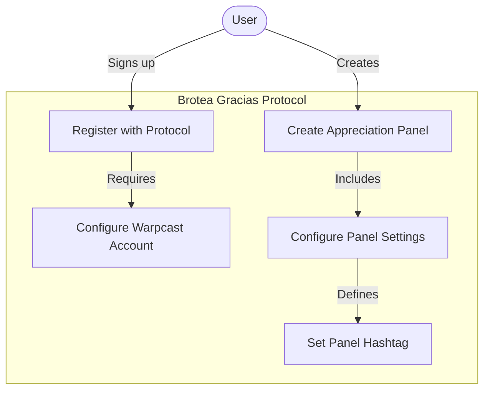
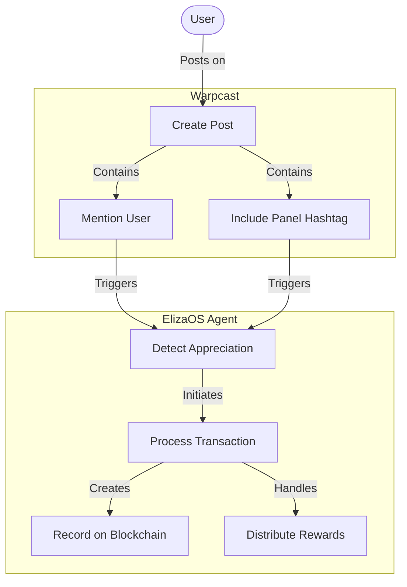
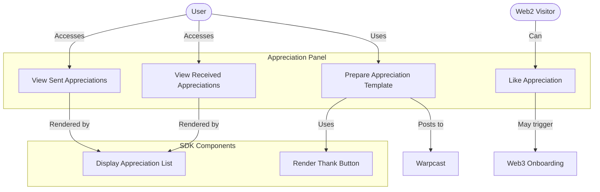
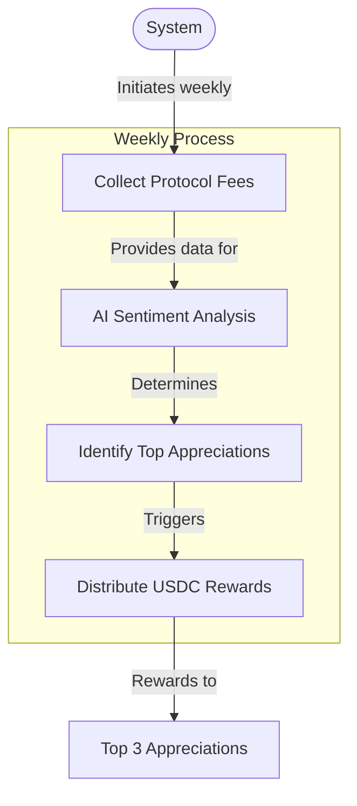
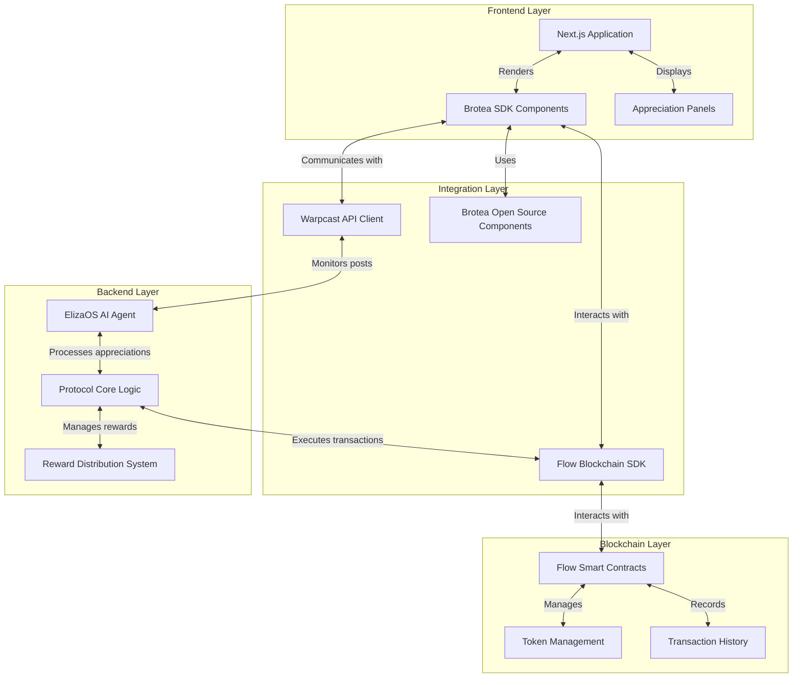
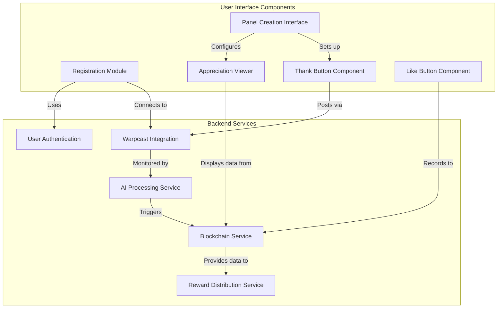
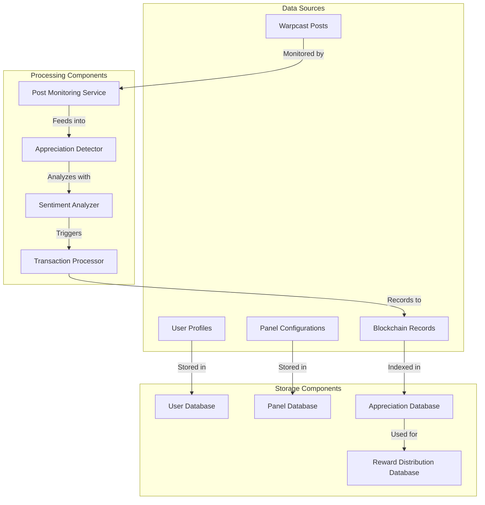

# Brotea Gracias Protocol Documentation

## Project Summary
The Brotea Gracias Protocol is a web3/web2 hybrid system designed to manage and incentivize appreciations between various entities (individuals, projects, communities) within the Brotea ecosystem. The protocol leverages blockchain technology to record appreciations, distribute rewards, and create a transparent, verifiable system of recognition that builds community and reinforces positive interactions.

## Key Objectives
- Create a decentralized appreciation system that works across web2 and web3 platforms
- Integrate with Warpcast for user authentication and social interaction
- Implement a token-based reward system for appreciations
- Enable users to create and manage public appreciation panels
- Provide SDK components for displaying appreciations on external sites
- Establish a sustainable economic model through transaction fees
- Distribute rewards to the most meaningful appreciations using AI sentiment analysis

## System Context

### Key Stakeholders
1. **End Users** - People who want to acknowledge others or receive appreciations
2. **Panel Creators** - Users who create and manage appreciation panels
3. **Web2 Visitors** - Non-wallet users who can validate appreciations via likes
4. **Protocol Administrators** - Brotea team managing the protocol infrastructure
5. **AI Agent (ElizaOS)** - Automated system for detecting and processing appreciations

### Technical Stack
- **Frontend**: Next.js
- **AI Agent**: ElizaOS
- **Blockchain**: Flow
- **Social Integration**: Warpcast

### Integration Points
- Warpcast API for authentication and social posts
- Flow blockchain for recording appreciations and managing tokens
- ElizaOS for AI-powered appreciation detection and sentiment analysis
- Brotea's existing open-source components

## Use Case Diagrams

### User Registration and Setup

### Sending Appreciations

### Appreciation Panel Interaction

### Weekly Reward Distribution

## Component Diagrams

### System Architecture

### User Flow Components

### Data Flow Components

## Risk/Constraints Matrix

| Risk/Constraint | Impact | Mitigation Strategy |
|-----------------|--------|---------------------|
| Warpcast API limitations | High | Implement robust error handling and rate limiting compliance |
| Flow blockchain transaction costs | Medium | Optimize batch processing and fee structure |
| AI accuracy in detecting appreciations | High | Continuous training and human review of edge cases |
| User adoption of web3 features | Medium | Provide seamless web2 experience with optional web3 onboarding |
| Security of user wallets | Critical | Leverage Warpcast's security model and add additional safeguards |
| Scalability of reward distribution | Medium | Implement efficient smart contracts and optimize gas usage |
| Regulatory compliance for token distribution | High | Consult legal experts and implement necessary compliance measures |
| Integration complexity with existing systems | Medium | Develop clear APIs and comprehensive documentation |

## Success Metrics

| Metric | Target | Measurement Method |
|--------|--------|-------------------|
| User Registration | 10,000 users in first 6 months | User database count |
| Appreciation Panels Created | 1,000 panels in first 3 months | Panel database count |
| Weekly Appreciations Processed | 5,000 per week by month 6 | Transaction logs |
| Web2 to Web3 Conversion Rate | 15% of web2 users onboard to web3 | Onboarding funnel analytics |
| Protocol Fee Revenue | Cover operational costs by month 9 | Financial reporting |
| User Retention | 70% monthly active user retention | Usage analytics |
| Sentiment Score Improvement | 25% increase in positive sentiment | AI sentiment analysis reports |
| SDK Integration | 100 external sites using SDK by year 1 | Integration tracking |

## Implementation Roadmap

1. **Phase 1: Core Infrastructure**
   - User registration and Warpcast integration
   - Basic appreciation detection
   - Flow contract development

2. **Phase 2: Panel System**
   - Panel creation and management
   - SDK development for external sites
   - Appreciation viewing components

3. **Phase 3: Reward Mechanism**
   - Transaction fee collection
   - AI sentiment analysis integration
   - Weekly reward distribution system

4. **Phase 4: Web2/Web3 Bridge**
   - Like button functionality
   - Web3 onboarding flow
   - Enhanced social features
